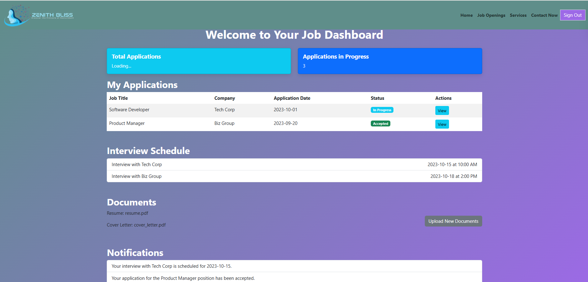
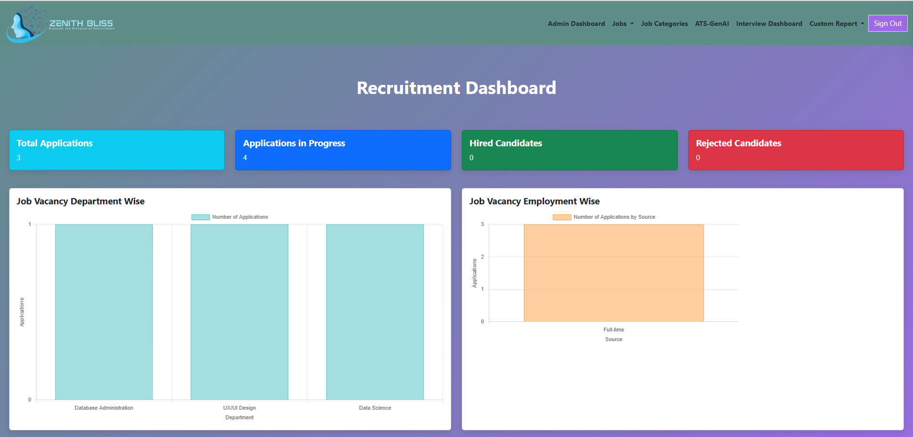
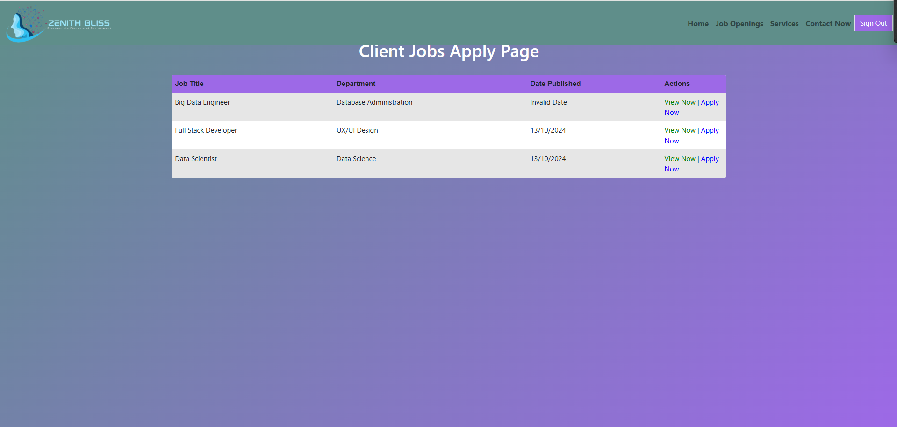

# 🌟 Zenith Bliss — Smart Recruiting Application

Zenith Bliss is a smart recruiting platform designed to streamline the hiring process for both employers and applicants. Built with **HTML**, **CSS**, **Bootstrap**, **Firebase**, and powered by **Gemini 1.5**, this application leverages modern web technologies to deliver a seamless recruitment experience.

---

## 🚀 Features

* 🔐 Admin & User authentication via Firebase
* 📄 Resume and application management
* 📊 AI-assisted screening (powered by Gemini 1.5)
* 📬 Real-time data storage with Firebase
* 🌐 Responsive design using Bootstrap
* ⚡ Deployed on Vercel for blazing-fast performance

---

## 🛠️ Technologies Used

* **Frontend**: HTML, CSS, Bootstrap
* **Backend**: Python
* **Authentication & Storage**: Firebase
* **Deployment**: Vercel
* **AI Assistant**: Gemini 1.5

---

## 🧪 Getting Started

### 🔧 Firebase Setup

First, create a Firebase project and replace the configuration with your own credentials in the appropriate file:

```javascript
export const firebaseConfig = {
    apiKey: "your-api-key",
    authDomain: "your-auth-domain",
    projectId: "your-project-id",
    storageBucket: "your-storage-bucket",
    messagingSenderId: "your-sender-id",
    appId: "your-app-id",
    measurementId: "your-measurement-id"
};
```

> 🔒 *Note: For security reasons, credentials are not included in this repository.*

---

## ⚙️ Running the Application

### Frontend

No build step is required. Simply open the HTML files in your browser after configuring Firebase.

### Backend

Clone the repository and run:

```bash
python app.py
```

---

## 🔐 Login Information

### Admin Login

```
Email: admin@gmail.com
Password: admin@gmail.com
```

### Normal Users

Please register via the user sign-up form on the platform.

---

## 🖼️ Screenshots

| Landing Page                             | Admin Dashboard                                     | Job Listings                  |
| ---------------------------------------- | --------------------------------------------------- | ----------------------------- |
|  |  |  |

---


